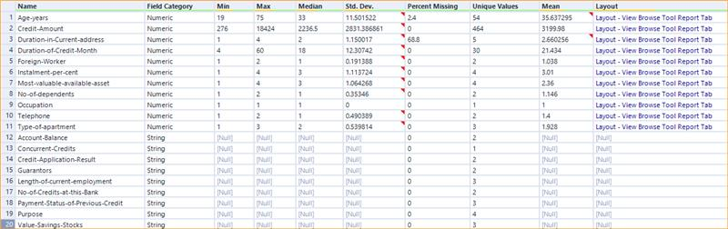
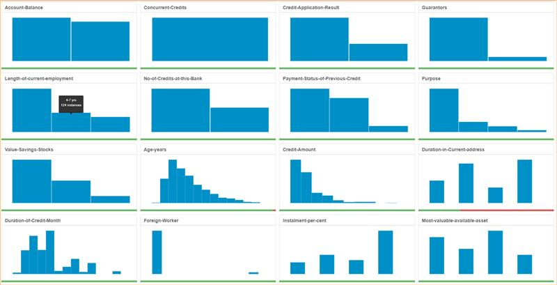
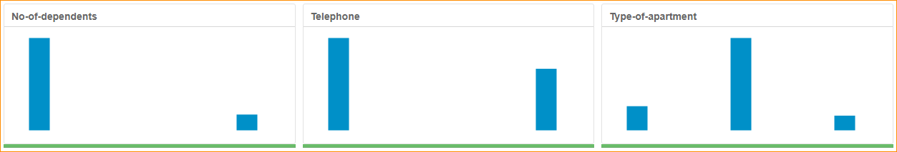
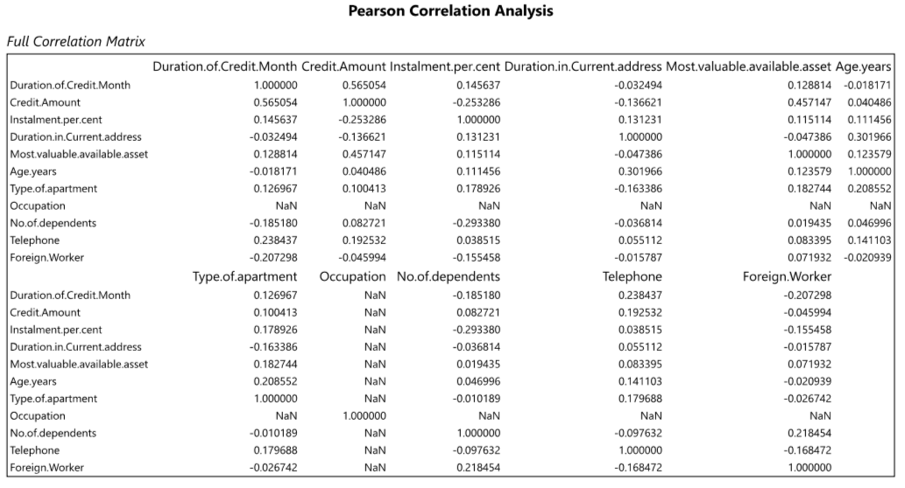
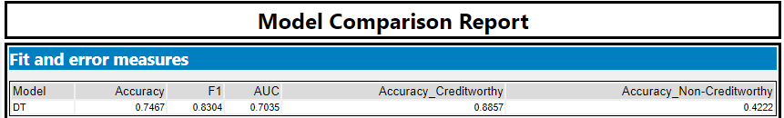
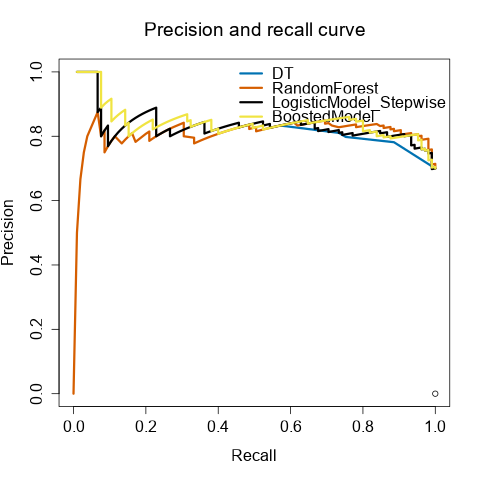

# Project: Creditworthiness
 
## Step 1: Business and Data Understanding

### Key Decisions : 
●	What decisions needs to be made?
- The objective is to build a predictive classification model to classify whether customers who applied for loan are creditworthy.   

●	What data is needed to inform those decisions?
The data needed can be summarized in three categories and  I listed few for each category:  
  - Personal information 
    - length of employeement 
    - duration of current address 
    - number of dependent 
  - Basic account information 
    - have account in bank or not and the balance
    - duration of credit month 
  - Loan information 
    - loan purpose
    - credit aount   

●	What kind of model (Continuous, Binary, Non-Binary, Time-Series) do we need to use to help make these decisions?
- Since the desired outcome is creditworthy or not, it would be a binary classification model. We'll go run logistic regression model, decision tree model etc respectively to compare the model accuracy. 

## Step 2: Building the Training Set

### EDA
#### Fields Summary
  
  This dataset contains 20 variables including 11 continuous variables and 0 categorical variables. We can gain more overview from the histogram of each variable.
   
   
  Before we jump into the model part, we'll clean and manipulate the dataset for model preparation. 

**1. Missing values**
  -  The `Duration of current address` has 69% missing data so this field should be removed. 
  -  We'll impute the missing value with median data in the `Age-year` field since it only has 2.4% missing data.  Since the age is right skewed, so we'll impute the data with median instead of mean. 
  
**2. Association Check: Correlation**
- We want to make sure the numeric variables are not highly correlated with each other.  
 
 - An assoication analysis is performed on the numeric variables and there are no variables which are highly correlated with each other (the `abs(correlation) is > 0.7` and the p-value is also not significant).   

**3. Varibility Check**
- We also want to remove data with low variability. Referring to the fields summary plots above, `Guarantors` , `Foreign Worker`, `No of Dependents` show low varibility where more than 80% of the data skewed towards to one value. These three fields should be removed in order not to skwe our model results.  

**4. Irrelevancy Check**
- `Telephone` field should be removed since its irrelevancy to the creditworthy. 

**Summary**
<table>
<thead>
  <tr>
    <th>Category</th>
    <th>Field</th>
    <th>Process</th>
  </tr>
</thead>
<tbody>
  <tr>
    <td rowspan="2">Missing Value</td>
    <td>Duration of current address</td>
    <td>Removed</td>
  </tr>
  <tr>
    <td>Age-Years</td>
    <td>Impute missing with median</td>
  </tr>
  <tr>
    <td rowspan="5">Low Varibility</td>
    <td>Guarantors</td>
    <td>Removed</td>
  </tr>
  <tr>
    <td>Foreign Worker</td>
    <td>Removed</td>
  </tr>
  <tr>
    <td>Occupation</td>
    <td>Removed</td>
  </tr>
  <tr>
    <td>Concurrent Credits</td>
    <td>Removed</td>
  </tr>
  <tr>
    <td>No of Dependents</td>
    <td>Removed</td>
  </tr>
  <tr>
    <td>Irrelevancy</td>
    <td>Telephone</td>
    <td>Removed</td>
  </tr>
</tbody>
</table>

## Step 3: Train Classification Models
- First, I created Estimation and Validation samples where 70% of the dataset should go to Estimation and 30% of entire dataset should be reserved for Validation. Set the Random Seed to 1.

- Then I'll create all of the following models: Logistic Regression, Decision Tree, Forest Model, Boosted Model.
- The target variable for all models is `credit application result`.

**1. Logistic Regression (Stepwise)**
- summary of the model 
  
- From this model we can tell that `Account-Some balance` ,`payment status CreditSomeProblems` , `Purpose`, and `Credit Amount` are the significant predictor variables with significant p-value. 

While this stepwise model has 76% accuracy and its Non-creditworthy group is 48%.

**2. Decision Tree**
- Decision Tree
  
- From this model we can tell that `Account-Some balance` ,`Value Saving Stock` , `Duration of Month` are the significant predictor variables with high variable importance. 
  
    
- The overall Model Accuracy is 79% while the accuracy for Non-creditworthy group is 42%. 

**3. Forest Model**
- Random Forest Model
   
   
- From this **Variable Importance Plot** we can tell that `Credit Amount` ,`Age.years` , `Duration of credit month` are the significant predictor variables with high variable importance. 
    
    
- The overall acuracy is 79.33% and the Non-creditworthy accuracy is 40%. 

**4. Boosted Model**
- Boosted Model
   
- From this **Variable Importance Plot** we can tell that `Credit Amount` ,`account balance` , `Duration of credit month` are the significant predictor variables with high variable importance. 

    
- The overall acuracy is 79.33% and the Non-creditworthy accuracy is 40%. 

## Step 4: Write-up

### Final Model Compare 
Here is the final four model comparison 
   
  
**Overall Accuracy** 
- We can find that both `Random forest model` and `boosted model` have the top 79.33% accuracy rate. 

**Accuracies in each segments** 
- Creditworthy:   `Random forest model` and `boosted model` 96%
- Non-Creidtworthy: `Logistic Regression Model` 48% 

**ROC curve**
   
- From the ROC curve we can see that the Random forest performs slightly better than others. 

**Other supporting Plots**
   
   
By comparing the above aspects, i choose the random forest model as it has the higher accuracy and less bais among two segments. 

### Q: How many individuals are creditworthy?
- In this step I used the random forest model to predict the customers from (customer-to-score) file. If the score of creditworthy is greater than score noncredictworthy then the person should be labeled as creditworthy. 
- The final result is there are 410 creidtworthy customers and 90 non-creditworthy customers.  

## Appendix 
Alteryx Workflow 
 