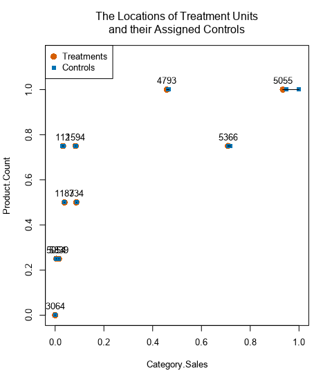
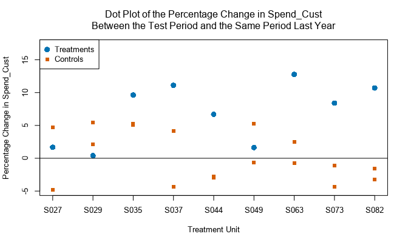
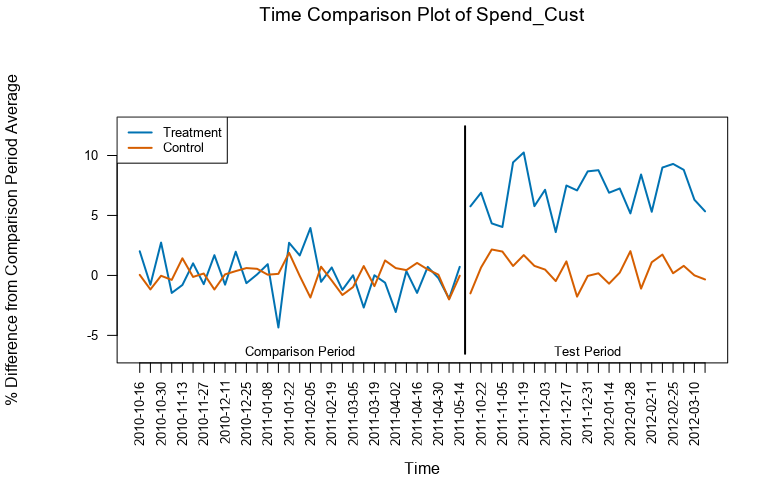
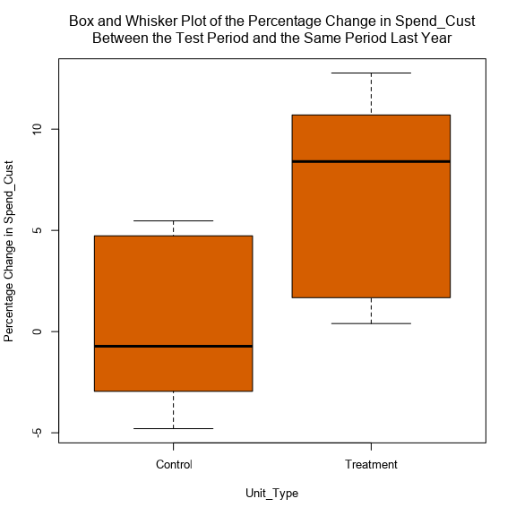
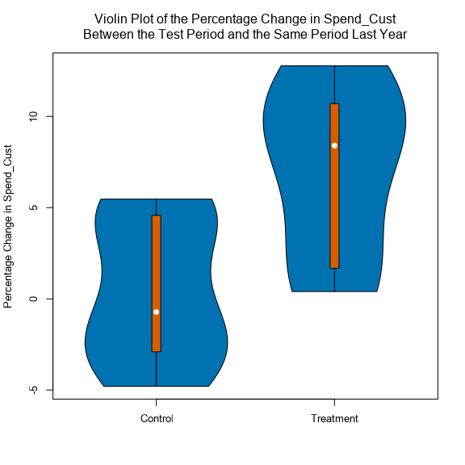
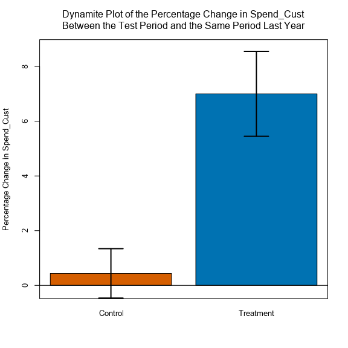

# AB Testing 

## Part1:  Randomized Design Tests 

****

## Part2: Matched Pair Design Tests 

p-value for a Welch's T-test 

### Example
  - Need to set the identifier (e.g. storeid)
  - Data measures to match treatments to controls : 
    - Numeric (e.g. Category Sales + Product Count)

### Report 

### Analyzing 

#### Interpretation 
- **6.7% lift**:
    - Lift = (Growth_Diff_Treatment_Store - Growth_Diff_Control_Store) / (1 + Growth_Diff_Control_Store)
    - A comparision of the treatment-control pairs indicates an average lift in `Spend_cust` for the treatment units over the control units of 6.7%. 
    - The average percentage change in `Spend_Cust` was 7% for the treatment units in the test period relative to the comparison period. The same measure was 0.4% for the control units. 
    - The difference between the treatment and control units was 6.6%, which is highly statistically significant.

- **Expected Impact. `Spend_Cust`**
  - The average expected impact of the treament on `Spend_Cust` is 0.2 per observation period. 

- **Significant level 99.7%**
  - The probability that the difference in the means of the performance between the treatment and control group is significantly difference from zero. 
  
- **Time comparison Plot**
  - The time comparison plot provides a visualization of the average effect of the test treatment across the treatment units for the performance measure of interest. 
  - The performance measure is normalized to be the percentage difference between the value of that measure in each reported time unit and the average of that measure for the entire comparison period, and then averaged across stores of each unit type (treatment or control) in each reported time unit. 

- **Dot Plot % change**
  - In the dot plot, each column of dots gives the year over year percentage change in the performance measure for each treament unit and its associated controls. 
  - A dot plot chart provides a snapshot of how each treament unit performed relative to its associated control units with respect to the performance measure. 
#### Summary 
Analysis of the Test on the Measure Spend_Cust
 
- Test Start Date: 2011-10-15  
- Test End Date: 2012-05-17  
- Additional Information:  
	
**Test Summary**
 
The average percentage change in Spend_Cust was 7.0% for the treatment units in the test period relative to the comparison period. This same measure was 0.4% for the control units, with the difference between the treatment and control units being 6.6%, which is highly statistically significant. More detailed summary statistics for the treatment and control groups are contained in the first table (which immediately follows), while the details of the hypothesis test of a significant difference in the mean average percentage change in Spend_Cust is contained in a table at the end of this report.
 
A comparison of the treatment-control pairs indicates an average lift in Spend_Cust for the treatment units over the control units of 6.7%, which results in an expected impact of 0 on Spend_Cust, with 77.8% of the treatment-control pairs exhibiting a positive lift for the treatment units.

**Plots of the Test Results**
 
In the dot plot(s) below, each column of dots gives the percentage change in Spend_Cust from the same period as the test period, but one year earlier, and the test period for a treatment unit and the control units assigned to that treatment unit. An examination of a dot plot chart allows for a rapid determination of whether (and which of) the treatment units outperformed the control units with respect to Spend_Cust.

The time comparison plot provides a visualization of the average effect of the test treatment across the test units for the performance measure of interest. The performance measure is normalized to be the percentage difference between the value of that measure in each reported time unit and the average of that measure for the entire comparison period, and then averaged across stores of each unit type (treatment or control) in each reported time unit.

The box and whisker plot provides information about the distribution of the percentage change in Spend_Cust between the test period and the same time period one year earlier for both the treatment and control units. In the plots, the bottom and top of the orange box are at the first and third quartiles, and the line inside the box is at the median for each test group. The vertical bars that extend above and below the box indicate the range of the data that is within 1.5 times the interquartile range (where the interquartile range is the difference between the values of the third and first quartiles). 

The violin plot provides information about the distribution of the percentage change in Spend_Cust between the test period and the same time period one year earlier for both the treatment and control units. The width of each "violin" for a given value of the Percentage Change in Spend_Cust is based on the local density of values near that point. Where the violin is thick there are a number of test units with similar values for the measure, while there are few values for the Percentage Change in Spend_Cust where the violin is comparatively thin. The inner (orange) portion of each violin is a box and whisker plot of the data, where the bottom and top of the orange box are at the first and third quartiles, and the white circle inside the box is at the median for each test group. The vertical bars that extend above and below the box indicate the range of the data that is within 1.5 times the interquartile range (where the interquartile range is the difference between the values of the third and first quartiles). 

In the dynamite chart the blue bar gives the mean value of the percentage change in Spend_Cust between the test period and the same time period one year earlier for both the treatment and control groups, while the black error bars provide a one standard error range around the mean values. If there is a statistically significant effect associated with the treatment, then the error bars for the treatment and control groups should not overlap.
****
## Glossary
- Click-through rate: 
How many users click on a given link, expressed as a percentage of total users who see the link.

- Control group: The set of units in an experiment that will receive a standard, unmodified experience, providing a baseline comparison for the treatment group.

- Control variables: Variables that are the most influential on the outcome of the target variable, used to make sure that treatment and control units are as similar as possible.

- Duration: How long an experiment will run for.

- Lift: Difference in observations from treatment to control group.

Linear regression: A method of modeling the relationship between a target variable and one or more control variables using a linear equation.

Population: The set of units to be used in an experiment.

P-value: The likelihood that the actual difference in mean values between the treatment and control groups is 0. The closer the P-value is to 0, the higher the likelihood that an actual difference in means has been observed. A P-value of 0.05 or below (indicating 95% likelihood of difference in means) is considered statistically significant.

Randomized design: An experimental setup in which units are assigned at random to either the treatment or control group. Used in scenarios with minimal opportunity to control variables, or in scenarios with a large enough volume and velocity of data to not be worried about bias.

Sample size: The number of units needed in an experiment to make statistically significant inferences about a larger population.

Target variable: What is being measured during an experiment.

Test of means: Statistical calculation of whether the mean values of the treatment and control groups are the same or different.

Treatment: The change made during an experiment, which will be given to units in the treatment group.

Treatment group: The set of units in an experiment that will receive a modified or manipulated experience, relative to the control group.

Treatment variable: The variable being changed to observe its effect on the target variable. Also called the experimental or independent variable.

T-test: A type of test used to determine if the results of an experiment are statistically significant or not, resulting in a P-value.

Unit of diversion: How units are assigned to either the treatment or control group.

Matched pair design experiment: An experiment in which treatment and control groups are set up by matching on a unit-by-unit basis using a set of control variables.

Matched pairing: The process of matching each treatment unit to one or more control units, based on their similarity across the set of control variables.

Significance level: 1 - p-value, used to indicate the likelihood that the results of an experiment are significant (>= 95%).

Categorical variable: A variable which falls into one of a finite set of distinct categories (e.g. a type of car).

Discrete variable: A numeric variable which has a finite and countable number of possible values (e.g. the number of cars sold).

Gross margin: The cost of goods sold, subtracted from the net revenue gained from selling said goods.

Price elasticity of demand: A measure of the relationship between a change in the quantity of an item that is demanded and a change in that item’s price.

Seasonality: Regular, predictable changes in observed data that recur on a cycle (e.g. sales of Christmas decor increase each year as Christmas approaches).

Trend: A pattern that can be observed in data over time.