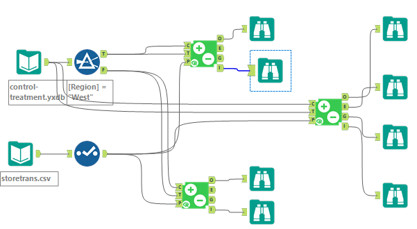

# Project: Analyzing a Market Test

## Step 1: Plan The Analysis

### Basic questions  
Q:  1.	What is the performance metric you’ll use to evaluate the results of your test?
- The total gross margin will be used as performance metric to evaluate whether we should introduce the new products in the menu (gourmet sandwiches and wines).
  
Q: 2.	What is the test period?
- a period of 12 weeks (2016-April-29 to 2016-July-21) 

Q: 3.	At what level (day, week, month, etc.) should the data be aggregated?
- The data should be aggreageted in week level. 

## Step 2: Clean Up The Data 
### EDA and Data Wrangling 

#### Dataset Overview 
- `round-roaster-stores.csv` - This file contains store information for each Round Roaster store in the USA.

- `treatment-stores.csv` - This file contains store information for each store that offered the new menu items.

- `round-roaster-transactions.csv`  - This file contains transaction level information for all of Round Roaster's stores

**round-roaster-stores:**
- Filter out irrelevancy fields: `Right_name`, `Phone_Number`,`Street_1`,.etc; 
- Converted numeric columns and date fields to correct data type;
- Removed the 1 record of missing value in `AvgMonthSales`;  

**treatment-stores:**
- Filter out irrelevancy fields: `Right_name`, `Phone_Number`,`Street_1`,.etc; 
- Converted numeric columns and date fields to correct data type;
- No need to remove/impuate any records as only few records of missing values found in irrelevant fields (`Phone_number` and `Stree_3`); 
- Create a field `Test_Group` as an identifier for whether is a treatment/control group with merged to transactions. 

**round-roaster-transactions:**
- Converted numeric columns and date fields to correct data type;
- Passed the missing values check so no need to remove/impuate any records; 
- Filter Out date:
  - Since we have test 12 week period (2016-April-29 to 2016-July-21) and comparitive period (2015-April-29 to 2015-July-21), data we need is 
  12 weeks prior to comparitive peiord(2015-April-29 ) + 1 year + test period = `[Invoice Date]>="2015-02-06" AND [Invoice Date]<"2016-07-22"` 
- Create Week, Week_Start, and Week_End field 
  - Week: `FLOOR(DateTimeDiff([Invoice Date], '2015-02-06', 'days') / 7+1)`
  - Week_Start:`DateTimeAdd('2015-02-06', 7*([Week]-1),'days')`
  - Week_End: `DateTimeAdd([Week_Start],6,'days')`
- Create a New_product_flag fields
  - Referring to the business context, the 'sandwich' and 'wines' are new products so the value of this varible is 1 if the product is in these two categories  
- All the stores has 76 weeks of data so no need to make any changes.   

Here is the detailed workflow of all the processes listed above:

****
### 

## Step 3: Match Treatment and Control Units
In this step, I will create the trend and seasonality variables, and use them along with other control variable(s) to match two control units to each treatment unit.

Apart from trend and seasonality
1.	What control variables should be considered?
   - **Sq_Ft** and **AvgMonthSales** are also good candidates for being control variable from the store dataset. 
2.	What is the correlation between your each potential control variable and your performance metric?

   - From above Pearson correlation analysis, we found the AvgMonthSales has high positive correlation with performance metric-- Gross Margin. 
  
3.	What control variables will you use to match treatment and control stores?
   - The avgMonthSales will be used together with Trend and Seasonality when matching the treatment and control stores.  

4.	Pair Scores 
Treatment Store	Control Store 1	Control Store 2

| Treatment Store | Control Store 1 | Control Store 2 |
|-----------------|-----------------|-----------------|
| 1664            |   7162              |   74881124          |
| 1675            | 1580            | 1807            |
| 1696            | 1964            | 1863            |
| 1700            |     2014        |  1630           |
| 1712            |   8162          |    1712         |
| 2288            |    9081         |   2568          |
| 2293            |       12219|9524               |
| 2301            | 3102|9238                 |
| 2322            | 2409|3235  |
| 2341            | 12536|2383  | 
		

Here is the detailed workflow of all the processes listed above:
		
		
		
## Step 4: Analysis and Writeup

**1.	What is your recommendation - Should the company roll out the updated menu to all stores?** 
- Yes, the company should roll out the updated menu to all stores as the lift in profit gross is greater than the 18% benchmark. 
  
**2.	What is the lift from the new menu for West and Central regions (include statistical significance)?**
- The lift from the new menu for West is 37.9% with statistical significance. 
  

- The lift from the new menu for Central is 43.5% with statistical significance. 
  

**3.	What is the lift from the new menu overall?** 
  - The lift from the new menu for Overvall is 40.7% with statistical significance. 
   

