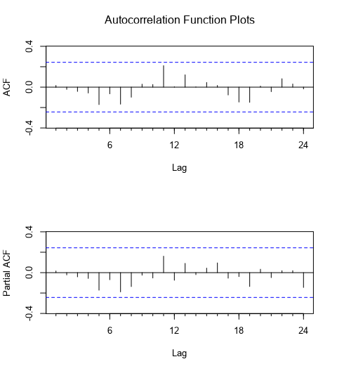

# Project: Forecasting Sales

## Step 1: Plan Your Analysis

Answer the following questions to help you plan out your analysis:
1.	Does the dataset meet the criteria of a time series dataset? Make sure to explore all four key characteristics of a time series data.

- Initial findings of the time series showed a complete series exhibiting the 4 key characteristics of time series data. The series is **over a continuous time interval**, of **sequential measurements** across that interval, using equal spacing between every two consecutive measurements and each time unit within the time interval has at most one data point.
The data collected is composed of monthly sales data dating back to 2008 and going until September 2013. 

2.	Which records should be used as the holdout sample?
- Last 4 records 2013-06 and 2013-09. 
  
## Step 2: Determine Trend, Seasonal, and Error components 

1.	What are the trend, seasonality, and error of the time series? Show how you were able to determine the components using time series plots. Include the graphs.
- The initial findings of the time series plot shows an upward rising trend with a regularly occurring spike in sales each year reported at the end of the year. This pattern shows that we have seasonality in our time series. There are no patterns within the series suggesting cyclicity.

- The decomposition plot shows our time series broken down into its three components: trend, seasonal and the error. Each of these components makes up our time series and helps us confirm what we saw in our initial time series plot. 
- Trend: 
  - Our trend line is confirmed as upward trending.
- Sesonality:
  - The seasonal portion shows that the regularly occurring spike in sales each year changes in magnitude, ever so slightly. Having seasonality suggests that any ARIMA models used for analysis will need **seasonal differencing**. The change in magnitude suggests that any ETS models will use a **multiplicative** method in the seasonal component.
- Error: 
  - The error plot of the series presents a fluctuations between large and smaller errors as the time series goes on. Since the fluctuations are not consistent in magnitude then we will apply error in a multiplicative manner for any ETS models.

## Step 3: Build your Models

Analyze your graphs and determine the appropriate measurements to apply to your ARIMA and ETS models and describe the errors for both models. (500 word limit)

Answer these questions:
### 1. ETS 
1.	What are the model terms for ETS? Explain why you chose those terms.
**ETS Model**
- Trend:  trend line exhibits linear behavior so we will use an additive method.
- Seasonality: changes in magnitude each year so a multiplicative method is necessary.
- Error: changes in magnitude as the series goes along so a multiplicative method will be used.
This leaves us with an ​ETS(M, A, M) model​.

2. Describe the in-sample errors. Use at least RMSE and MASE when examining results 
- The in-sample error measures give us a look at how well our model is able to predict future values.
- RMSE: in-sample standard deviation 
- MASE: compare forecasts of different models 
  - The MASE shows a fairly strong forecast at .41 with its value falling well below the generic 1.00, the commonly accepted MASE threshold for model accuracy.

### 2. ARIMA 
1.	What are the model terms for ARIMA? Explain why you chose those terms. Graph the Auto-Correlation Function (ACF) and Partial Autocorrelation Function Plots (PACF) for the time series and seasonal component and use these graphs to justify choosing your model terms.

- Since there are seasonal components found in the time series I will use an ARIMA(p, d, q)(P, D, Q)S model for forecasting. 

**Time Series ACF and PACF:**
- The ACF presents slowly decaying serial correlations towards 0 with increases at the seasonal lags. Since serial correlation is high I will need to seasonally difference the series.
 

#### Stationalize 
**Seasonal Difference ACF and PACF:** 
- The seasonal difference presents similar ACF and PACF results as the initial plots without differencing, only slightly less correlated. In order to remove correlation we will need to difference further.
  

**Seasonal First Difference:** 
- The seasonal first difference of the series has removed most of the significant lags from the ACF and PACF so there is no need for further differencing. The remaining correlation can be accounted for using autoregressive and moving average terms and the differencing terms will be d(1) and D(1).
- The ACF plot shows a strong negative correlation at lag 1 which is confirmed in the PACF. This suggests an MA(1) model since there is only 1 significant lag. The seasonal lags (lag 12, 24, etc.) in the ACF and PACF do not have any significant correlation so there will be no need for seasonal autoregressive or moving average terms.
  

Therefore the model terms for my ARIMA model is 
##### ARIMA (0,1,1)(0,1,0)[12]

a.	Describe the in-sample errors. Use at least RMSE and MASE when examining results
b.	Regraph ACF and PACF for both the Time Series and Seasonal Difference and include these graphs in your answer.

**Error Terms:**
- The ACF and PACF results for the ARIMA(0, 1, 1)(0, 1, 0)[12] model shows no significantly correlated lags suggesting no need for adding additional AR() or MA() terms.

Two key components to look at are the RMSE, which shows the in-sample standard deviation,
and the MASE which can be used to compare forecasts of different models. We can see that
our variance is about 37000 units around the mean.
The MASE shows a fairly strong forecast at .36 with its value falling well below the generic 1.00,
the commonly accepted MASE threshold for model accuracy.

## Step 4: Forecast

Answer these questions.

1.	Which model did you choose? Justify your answer by showing: in-sample error measurements and forecast error measurements against the holdout sample.

**In sample**
 -  ETS
   
 - ARIMA  
    
- When comparing the two in-sample error measures we used, the RMSE and MASE, we see
 ARIMA model has a narrower standard deviation but only by a few
thousand units. And ARIMA model's MASE shows a fairly strong forecast at .36 with its value falling well below the generic 1.00, than 0.41 of ETS model's. 
This in-sample error measures sugguest that ARIMA models performs better than ETS model. 

**Hold out sample**
Then we're looking at the model’s ability to predict the holdout sample, we see that the ARIMA model has better predictive qualities in just about every metric.

When looking at the model’s ability to predict the holdout sample, on average, we see that the ARIMA model
has better predictive qualities in just about every metric.
For our forecast, we will use the ARIMA model. 

2.	What is the forecast for the next four periods? Graph the results using 95% and 80% confidence intervals.

Forecast results using 95% and 80% confidence intervals:

## Other 
