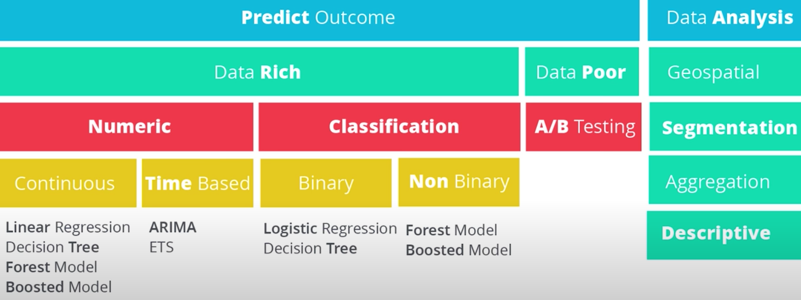
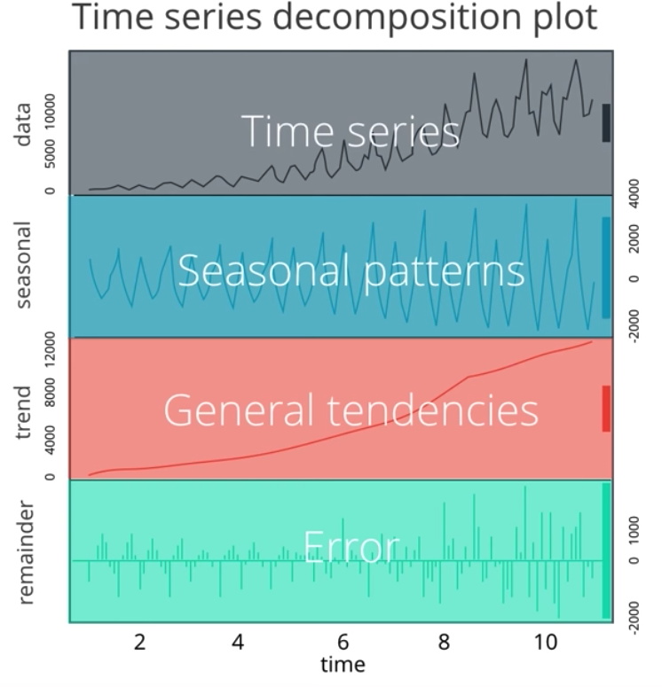

# Time Series Forecasting
*Use of statistical model to predict future values based on past results* 

## Outline 
- <a href="t1">Fundamentals</a>
- <a href="t2">ETS Models</a> (Exponential Smoothing)
- <a href="t3">ARIMA Models</a> (Autoregressive Integrated Moving Average)
  
## Fundamentals 

- Understand business problem

### Introduction 
- Odering Matters 
  - *a dependency on time and changing the order could change the meaning of the data.*
  - so data should be **Sequential** and **Equal** 
- Time Series Components 
  - X/Y: 
    -  Time on the horizontal axis and the target variable's values are shown on the vertical axis. 
  - Series: 
    -  the series shows a general trend up/down and to the right. 
  - Patterns:
     1. Trend: 
          - upward/downward/stationary trend  
     2. Seasonality / cycle: 
          - repeating pattern at fixed intervals of time. regularly occurring fulctuations up/down within a certain period of time
### Basic Models 
<table>
<thead>
  <tr>
    <th>Method</th>
    <th></th>
  </tr>
</thead>
<tbody>
  <tr>
    <td>Simple Exponential Smoothing</td>
    <td>Find the level of the ts</td>
  </tr>
  <tr>
    <td>Holt's Linear Trend</td>
    <td>find the levels of ts, additive model for linear trend</td>
  </tr>
  <tr>
    <td>Exponential Trend</td>
    <td>find the level of ts, multiplicative model for exponential trend</td>
  </tr>
  <tr>
    <td>Holt-Winter Seasonal</td>
    <td>find the level of time series, additive for trend, multiplicative and additive for seasonal components</td>
  </tr>
</tbody>
</table>

## ETS Models 

*Exponential smoothing models*
- Use weighed average of past observations, giving more weight to the most recent observation with weights gradually getting smaller as the observation gets older. 
- TIME SERIES = Error, trend, Sesonality (BY + or *)

- $+ Linear Behavior $ 
   when the trend and seasonal variation are relatively constant over time  
- $ * Exoiential Behavior$ 
  trend and seasonal variation increases, or decreases in magnitude over time  

e.g. **ETS(A,A,M):** A time series model that has increasing error, exponential trend, and no seasonality 

## ARIMA Models 

- Auto Regressive Integrated Moving Average Model 

### Non seasonal ARIMA
- AR I MA (p d q) 
1. **AR (p)**
  p = number of periods of ts used in the calculation 
  (e.g.2 using two previous periods of ts in the autoregression )
2. **I(d)** Differencing Term
  d = number of transformations used in the process
3. **MA(q)**
  q= lags of the error component 
### seaonal ARIMA