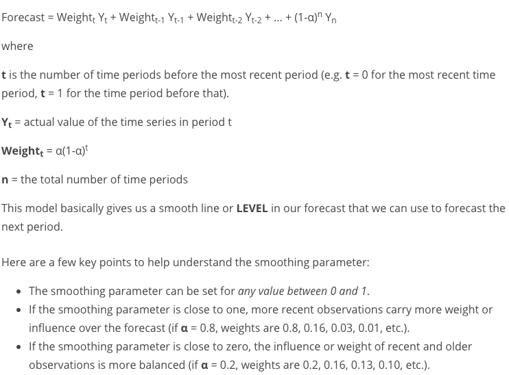
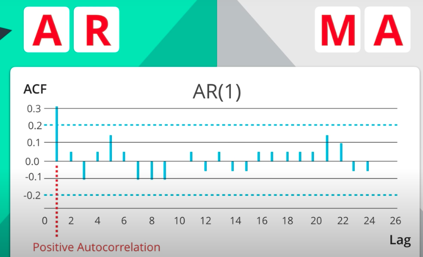
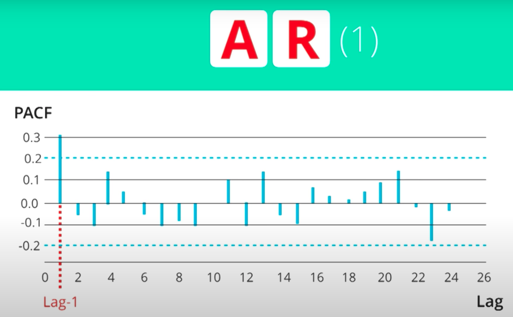
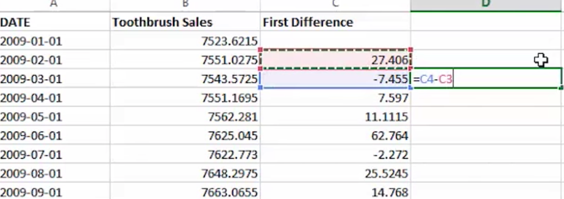

# Time Series Forecasting
*Use of statistical model to predict future values based on past results* 

## Outline 
- <a href="t1">Fundamentals</a>
- <a href="t2">ETS Models</a> (Exponential Smoothing)
- <a href="t3">ARIMA Models</a> (Autoregressive Integrated Moving Average)
  
## Fundamentals 

### Introduction 
- Odering Matters 
  - *a dependency on time and changing the order could change the meaning of the data.*
  - so data should be **Sequential** and **Equal** 
- Time Series Components 
  - X/Y: 
    -  Time on the horizontal axis and the target variable's values are shown on the vertical axis. 
  - Series: 
    -  the series shows a general trend up/down and to the right. 
  - Patterns:
     1. Trend: 
          - upward/downward/stationary trend  
     2. Seasonal vs. Cyclical: 
          - Seasonal: repeating pattern at fixed intervals of time. regularly occurring fulctuations up/down within a certain period of time
          - Cyclical: repeating pattern at unfixed intervals (e.g. stock market)

## 1. E.T.S Models 
### Basic Models 
<table>
<thead>
  <tr>
    <th>Method</th>
    <th>Smoothing</th>
    <th></th>
  </tr>
</thead>
<tbody>
  <tr>
    <td>Simple Exponential Smoothing</td>
    <td>level</td>
    <td>smoothing the level    the higher the alpha, the lower the estimation</td>

  </tr>
  <tr>
    <td>(Double Expeonential Smoothing) Holt's Linear Trend</td>
     <td>level+ additive trend</td>
    <td></td>
  </tr>
  <tr>
    <td>Exponential Trend</td>
     <td>level+ multiplicative trend</td>
    <td></td>
  </tr>
  <tr>
    <td>Holt-Winter Seasonal</td>
    <td>level+ additive trend + multiplicative and additive seasonal</td> 
    <td>find the level of time series, additive for trend, multiplicative and additive for seasonal components</td>
  </tr>
</tbody>
</table>

*Exponential smoothing models*
- Use weighed average of past observations, giving more weight to the most recent observation with weights gradually getting smaller as the observation gets older. 
- TIME SERIES = Error, trend, Sesonality (BY + or *)

- $+ Linear Behavior $ 
   when the trend and seasonal variation are relatively constant over time  
- $ * Expoiential Behavior$ 
  trend and seasonal variation increases, or decreases in magnitude over time  

e.g. **ETS(A,A,M):** A time series model that has constant error, linear trend, and increasing seasonality  

- This chart shows increasing trend, constant reminder, and constant seaonality 

## 2. ARIMA Models 

- Auto - Regressive - Integrated - Moving - Average - Model 

### 2.1. Non seasonal ARIMA
- AR I MA (p d q)  
#### a. **AR auto-regression (p)**
  p = number of auto regressive
  (e.g.2 using two previous periods of ts in the autoregression )
- ACF plot (used to choose AR or MA )
  - Will show autocorrelation decaying towards 0. 
  correlation coefficient in the y axis 
  - positive autocorrelation : AR
  - negative autocorrelation : MA 
  
- PACF plot (partial correlation )
  - cut off quickly towards 0. 
  - dropped gradually -> MA model 
  - dropped at lag_k then -> AR(k)
  -  dropped at lag_1 then we choose AR(1)

#### b. **I itergrated component term(d)** 
  - degree of differencing 
  - transform the series into stationary one (without trend or seasonality)
  d = number of transformations used in the process
  **Calculation**
  - first difference: b2-b1, b3-b2
  - second difference: 
  - repeat the process untill the `mean of Col(nth difference) = 0` 
  **Q: why need to change to stationary?** 
    - stationary trend has a constant mean and variance overtime. A stationarized series is relatively easy to predict for models. 
#### c. **MA Moving average (q)**
  q= lags of the error component  ( the number of moving average terms) 
  - if there is random jumps (error that is calculated in ARIMA model); MA() model will smooth out the impact of sudden movements in the data 
  - When to use:
    - ACF: negatively autocorrelated at Lag_1
    - ACF sharply cut off after a few lags 
    - PACF decreases out more gradually 

[More info](http://people.duke.edu/~rnau/411arim3.htm)
### 2.2 Seaonal ARIMA (p,d,q)(P,D,Q)m
- m refers to a number of periods in each season 
 - (P,D,Q) auto regressive differencing and moving average term for the seaonal part of the ARIMA model 

### Build Process 

- Step 1 - Check stationarity: 
  - If a time series has a trend or seasonality component, it must be made stationary before we can use ARIMA to forecast. Use the TS Plot tool to see if the time series is stationary.
- Step 2 - Difference: 
  - If the time series is not stationary, it needs to be stationarized through differencing. Take the first difference, then check for stationarity. Take as many differences as it takes. Make sure you check seasonal differencing as well.
- Step 3 - Filter out a validation sample: 
  - This will be used to validate how accurate our model is. Use the last 6 periods as the validation sample.
- Step 4 - Select AR and MA terms: 
  - Use the ACF and PACF to decide whether to include an AR term(s), MA term(s), or both.
- Step 5 - Build the model: 
  - Build the model and set the number of periods to forecast to 6.
- Step 6 - Validate model: 
  - Compare the predicted values to the actuals in the validation sample.

## Analyzing and Visualizing results 
important properies:
  - patterns of variation 
  - effects of seasonality 
  - removing autocorrelation 

comparing  ETS vs ARIMA criteria:
  - residual plots 
    - should be not correlated 
    - should have a ~0 mean 
  - forecasting errors  
  - Akaike information criteria (AIC)
    - a measure of relative quality of a statistical model ; deals with tradeoff between the goodness of fit of the model and the complexity of the model
     
comparing  forecast criteria:
 - holdout sample vs validation sample 

## Interpreting measure of error 
### Scale Dependent Errors
Scale dependent errors, such as mean error (ME) mean percentage error (MPE), mean absolute error (MAE) and root mean squared error (RMSE), are based on a set scale, which for us is our time series, and cannot be used to make comparisons that are on a different scale. For example, we wouldn’t take these error values from a time series model of the sheep population in Scotland and compare it to corn production forecast in the United States.

- **Mean Error (ME)** shows the average of the difference between actual and forecasted values. 
- **Mean Percentage Error (MPE)** shows the average of the percent difference between actual and forecasted values. Both the ME and MPE will help indicate whether the forecasts are biased to be disproportionately positive or negative.
- **Root Mean Squared Error (RMSE)** represents the sample standard deviation of the differences between predicted values and observed values. These individual differences are called residuals when the calculations are performed over the data sample that was used for estimation, and are called prediction errors when computed out-of-sample. This is a great measurement to use when comparing models as it shows how many deviations from the mean the forecasted values fall.
- **Mean Absolute Error (MAE)** takes the sum of the absolute difference from actual to forecast and averages them. It is less sensitive to the occasional very large error because it does not square the errors in the calculation.
## Percentage Errors
Percentage errors, like MAPE, are useful because they are scale independent, so they can be used to compare forecasts between different data series, unlike scale dependent errors. The disadvantage is that it cannot be used if the series has zero values.

- **Mean Absolute Percentage Error (MAPE)** is also often useful for purposes of reporting, because it is expressed in generic percentage terms it will make sense even to someone who has no idea what constitutes a "big" error in terms of dollars spent or widgets sold.
## Scale-Free Errors
Scale-free errors were introduced more recently to offer a scale-independent measure that doesn't have many of the problems of other errors like percentage errors.

- **Mean Absolute Scaled Error (MASE)** is another relative measure of error that is applicable only to time series data. It is defined as the mean absolute error of the model divided by the the mean absolute value of the first difference of the series. Thus, it measures the relative reduction in error compared to a naive model. Ideally its value will be significantly less than 1 but is relative to comparison across other models for the same series. Since this error measurement is relative and can be applied across models, it is accepted as one of the best metrics for error measurement.
**** 

## Glossary
Additive method: used when trend or seasonality is relatively constant over time

Damped trend model: a solution that implements a parameter which will dampen a trend line into a flat line sometime in the future

Decomposition plot: a plot showing a time series split out into its error, trend, and seasonal components

Error: the difference between an observed value and the trend line estimate of that value

Exponential smoothing model: a type of forecasting model that uses weighted averages of past values to predict future values (also called an ETS model)

Exponential Trend Method: a variation of Holt’s Linear Trend Method in which the level and trend calculations are multiplicative, rather than additive

Holt’s Linear Trend Method: a forecasting method that combines two calculations, one for level and one for trend, used for non-seasonal data (also known as double exponential smoothing)

Holt-Winters Seasonal Method: a forecasting method that can be used for data with a seasonal pattern, uses three smoothing equations (for level, trend, and seasonality)

Multiplicative method: used when trend or seasonality increases or decreases over time

Simple exponential smoothing method: a forecasting model used for data with no trend or seasonality, in which forecasts are determined by multiplying past values by a set of relative weights calculated by a smoothing parameter

ARIMA model: autoregressive integrated moving average model, can be seasonal or non-seasonal

Autocorrelation: the degree to which a time series is correlated with its own past values

Autocorrelation function (ACF) plot: a plot that shows the correlation of a time series with itself, lagged by X time units

Autoregressive (AR) component: acts like a linear regression model, used to forecast a variable based on a combination of past values of that variable

Differencing: the process by which a time series is made stationary

Integrated (I) component: the amount of differencing required to stationarize a time series

Moving average (MA) component: used if a time series has random jumps which affect two or more consecutive periods

Partial autocorrelation: correlation between two variables controlling for the values of another set of variables

Seasonal difference: a series of changes from one season to the next

Stationarity: when a time series has a constant mean and variance over time

Akaike Information Criterion (AIC): a measure of the relative quality of a statistical model, used to compare several models produced from the same time series

Confidence interval: an interval within which a forecast value is expected to lie

Holdout sample: a subset of a time series that can be withheld and then used to check the accuracy of a model (also known as a validation sample)

Residual: the difference between an observed value and the forecast value