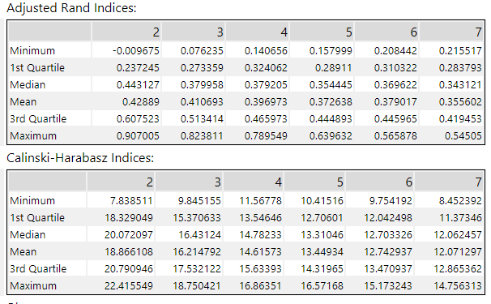
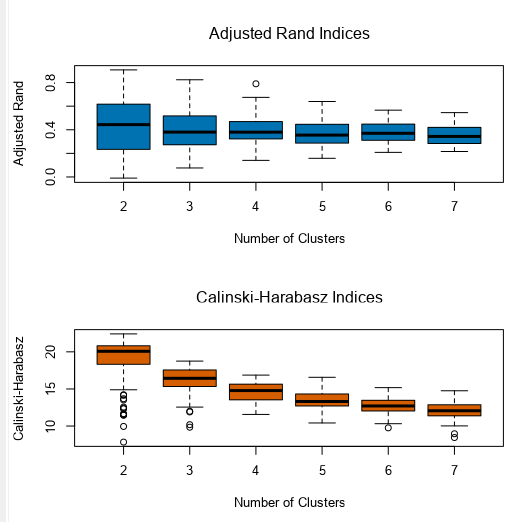
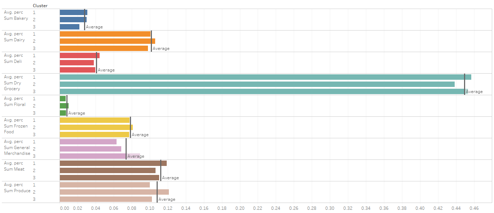
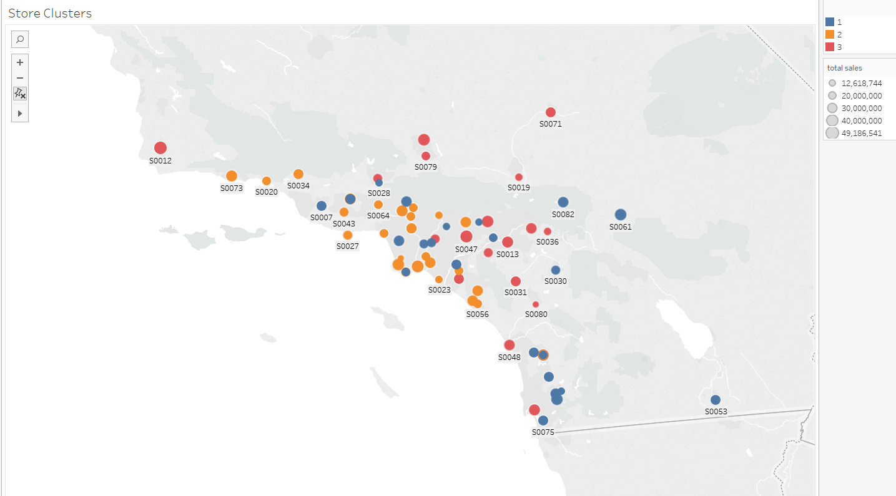
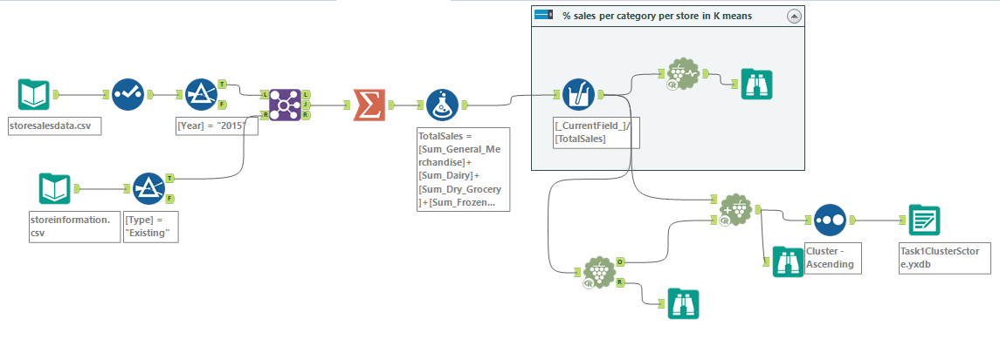

# Project: Predictive Analytics Capstone

## Task 1: Determine Store Formats for Existing Stores
### Background  
- To remedy the product surplus and shortages, the company wants to introduce different store formats. Each store format will have a different product selection in order to better match local demand. The actual building sizes will not change, just the product selection and internal layouts. The terms "formats" and "segments" will be used interchangeably throughout this project. You’ve been asked to:

### Request   
- Determine the optimal number of store formats based on sales data.
  - Sum sales data by `StoreID` and `Year`
  - Use percentage sales per category per store for clustering (category sales as a percentage of total store sales).
  - Use only 2015 sales data.
  - Use a **K-means clustering model**.
- Segment the 85 current stores into the different store formats.
-  Use the `StoreSalesData.csv` and `StoreInformation.csv` files.

### Content   

**1.	What is the optimal number of store formats? How did you arrive at that number?**

  
  
- Based on the two indices in K-means analysis report and the plots,
 though cluster number of 2 has higher indices number, it has the widest spread comparing other boxs. This indicates that the cluster number of 2 has lower distinctness and compactness. 
 The number of store format **3** is better as it has relatively higher AR and CH meidan scores/compact spread overall. 

**2.	How many stores fall into each store format?**
  
  - Cluster 1: 25 stores 
  - Cluster 2: 35 stores 
  - Cluster 3: 25 stores 

**3.	Based on the results of the clustering model, what is one way that the clusters differ from one another?**
 
 - I used the tableau visualization to see each cluster's sales percentage per category with the cluster averages. Here are my findings:
   - Cluster1: sold more in Dry Grocery and Meat 
   - Cluster2: sold more in Produce and Dairy 
   - Cluster3: sold more in Merchandise

**4.	Please provide a Tableau visualization (saved as a Tableau Public file) that shows the location of the stores, uses color to show cluster, and size to show total sales.**
 

### Alteryx Workflow
 
**Process:**
1. Select sales information in the year of 2015
2. Join with sales information table `(Type='Existing')`
3. Get the total sales per store in 2015
4. Convert the sales to sales percentage per category per store 
5. Run K-diagnostic analysis to find the optimal `K`  
6. Run K-means model with optimal `K` 
7. Append K cluster to the origional processed data with cluster tag  
8. Visualization in Tableau 

****
## Task 2: Formats for New Stores 
### Background 
- The grocery store chain has 10 new stores opening up at the beginning of the year. The company wants to determine which store format each of the new stores should have. However, we don’t have sales data for these new stores yet, so we’ll have to determine the format using each of the new store’s demographic data.
### Request 
- Develop a model that predicts which segment a store falls into based on the demographic and socioeconomic characteristics of the population that resides in the area around each new store.
- Use a 20% validation sample with Random Seed = 3 when creating samples with which to compare the accuracy of the models. Make sure to compare a **decision tree**, **forest**, and **boosted model**.
- Use the model to predict the best store format for each of the 10 new stores.
- Use the `StoreDemographicData.csv` file, which contains the information for the area around each store.

### Content 
**1.	What methodology did you use to predict the best store format for the new stores? Why did you choose that methodology? (Remember to Use a 20% validation sample with Random Seed = 3 to test differences in models.)**
  
  - We can see that the random forest and boosted model show higher accuracy than decision tree model. 
    I choose the boosted model since its more efficient.
**2.	What format do each of the 10 new stores fall into? Please fill in the table below.**
   
|Store Number|	Segment|
|---|--|
|S0086	|  1|
|S0087	| 2|
|S0088	| 3|
|S0089	| 2|
|S0090	| 2|
|S0091	| 3|
|S0092	| 2|
|S0093	| 3|
|S0094	| 2|
|S0095	| 2|

### Alteryx Workflow

****

## Task 3: Predicting Produce Sales

### Background 
- You’ve been asked to prepare a monthly forecast for produce sales for the full year of 2016 for both existing and new stores. To do so, follow the steps below.

### Request 
Use a 6 month holdout sample for the TS Compare tool (this is because we do not have that much data so using a 12 month holdout would remove too much of the data)

**Step 1:** To forecast produce sales for existing stores you should aggregate produce sales across all stores by month and create a forecast.

**Step 2:** To forecast produce sales for new stores:

- Forecast produce sales (not total sales) for the average store (rather than the aggregate) for each segment.
- Multiply the average store produce sales forecast by the number of new stores in that segment.
- For example, if the forecasted average store produce sales for segment 1 for March is 10,000, and there are 4 new stores in segment 1, the forecast for the new stores in segment 1 would be 40,000.
- Sum the new stores produce sales forecasts for each of the segments to get the forecast for all new stores.

**Step 3:** Sum the forecasts of the existing and new stores together for the total produce sales forecast.

#### Questions
**1. What type of ETS or ARIMA model did you use for each forecast? Use ETS(a,m,n) or ARIMA(ar, i, ma) notation. How did you come to that decision?**
I used ETS model for my forecast. 

Here is my process:
**Time Series Decomposition**

- From this report, time series decomposition plot, we can tell that :
  - Trend: is zero (N) 
  - Reminder: irregular and no clear pattern so multiplicative  (M)
  - Seasonal: multiplicative (M)

Since the auto correlation from ACF plot is significant, we need to stationalize the time series using differencing method. 

**Stationalizing**
1. Seasonal difference 

We can see that ACF plot still show signficant AC when we applied seasonal difference. So lets take the first degree of differenciation to see if that works 
2. 1st Seasonal difference 
   

Now the ACF and PACF both looks good! We'll take the first seasonal difference to correct for seasonality before the dataset stationary.
1. Check for parameters 
   - From non-seasonal ACF and PACF, it has a positive AC and PACF dropped at lag_1 
     hence the p = 1, d= 0, and q = 0
   - From stationalized ACF and PACF, we can see that the seasonal autocorrelation is negative, so we choose MA, 
     set the Q= 1  

Final ARIMA model **ARIMA(1,0,0)(0,1,1)[12]**

- ETS(MNM)
- ARIMA model **ARIMA(1,0,0)(0,1,1)[12]**

**Model Selection**

1. Compare in sample errors 
  ETS model 

  ARIMA model 

- By comparing the in-sample error, we found ARIMA model has a slighly lower RMSE and MASE. 

2. Model compare by using holdout sample 
  

  - ETS model has better performance in holdout sample with lower RMSE and MASE.
    So i'll choose ETS model for my forecast.

**4. Please provide a table of your forecasts for existing and new stores. Also, provide visualization of your forecasts that includes historical data, existing stores forecasts, and new stores forecasts.**
- Here is the 2016 forecast of 
  - 1 new store from segment 1 
  - 6 new store from segment 2 
  - 3 new store from segment 3
Below is the 2016 new stores forecasted revenue 

Below is the 2016 new and existing stores's forecasted revenue 

### Alteryx Workflow

