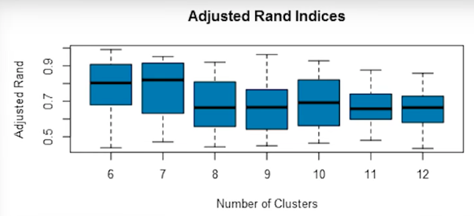
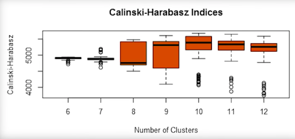

#  Segmentation and Clustering 

## Basics 
- given the characteristics of a set of objects, this procedure groups similar objects into clusters.
**Intra-cluster** separation is minimized (within cluster)
**Inter-cluster** separation is maximized (cluster to cluster)

**Background**: 
  - Lowes has over 2000 stores across the US and wants to ensure that it places the various product items in the stores at the appropriate time considering the wheather seasons. 
    e.g. This sctore wants to place barbecue grills in their stores where the consumers will interested in barbecuing.
****
## P1. Preparing Data for Clustering 
### Scaling & Transforming 
- to elimite bias 

e.g. In this example, we need the winter freeze date. so we transform the `Date last winter freeze` date field by substrating the median. 

****
## P2. Variable Reduction (PCA)
*Account for the most of the variance in all of the observed variables.*
### Factor Analysis vs Component Analysis 
**Factor analysis:**
  - What might be causing the responses    
  - accounts only correlation between variables 

**PCA:** 
  -  methodology:
     -  for the first component, it will calculate a component line that represents the best fit 
        for the data, that will capture as much of the variance as possible. For the second component, it will calculate another line that represents the best fit for the remaining variance
        (since remaining variance should not be correlated to the original variance, by nature its at right angles to the first line.)
  -  accounts for total variation
  -  Summarize varibles 
  -  **Rule of Thumb**
     -  for the total amount of variance to be captured by the kept components would be 80%.

****
## P3. Clustering Models 
### A. Hierarchical Clustering
#### Method1: (bottom up) 
- **Process** :
  -  starts process with each object in its own cluster and with each step, it will merge(*linkage*) the two most similar clusters. 
  -   **Linkage**:
        -   Single linkage: measures the distance of closest pair points
        -   Complete linkage:  measures the distance between the farthest pair of points
        -   Average linkage: average distance between all of the points
        -   Centroid linkage : measures the distance between cluster centroid (center points)
#### Method2: (top down)
- **Process** : 
  - Starts the process with all the objects in a single cluster, then removeds the outsider from the least cohesive cluster. This process stops when each object has its own cluster. 

### 2. K-centroid Clustering 
- These methods work by taking the records in a database and dividing (partitioning) them into the “best” K groups based on some criteria
- **Process:**
  - Specify number of clusters K.
  - Initialize centroids by first shuffling the dataset and then randomly selecting K data points for the centroids without replacement.
  - Keep iterating until there is no change to the centroids. i.e assignment of data points to clusters isn’t changing.
  - Compute the sum of the squared distance between data points and all centroids.
  - Assign each data point to the closest cluster (centroid).
  - Compute the centroids for the clusters by taking the average of the all data points that belong to each cluster.

****
## P4. Validating and Applying Clusters 
### A: Hierarchical clustering 
- use the dendrogram to set the cut off number
### B: K-centroid method 

#### B1. Internal Validation 
- Compactness : Intra-cluster 
- Distinctness : Inter-cluster 
##### Method : using indices 
1. Adjusted Rand Index 
   - to check the similarity of objects within clusters (compactness)
   
   - the higher the AR the better stability of the cluster  
2. Calinski-Harabasz Index (CH)
   - both compactness and distinctness 
  
   - the higher the CH the better the compactness and distinctness

**Select**
- Higher median and compact spread 

#### B2. External Validation 
****
## Another Project 